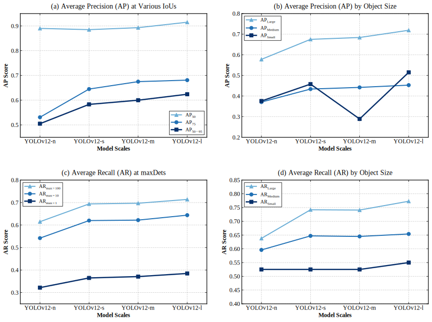
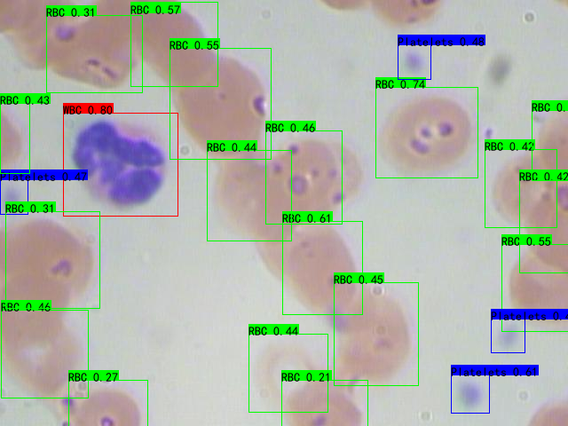

[简体中文](README.md) | [English](README_EN.md)
# YOLOv12：原生PyTorch上的精简复现


## 项目简介
本项目是基于PyTorch的 YOLOv12 复现，代码架构简洁清晰，可读性强，并附以**原创的 YOLOv12 流程图**。模型内部应用了 SDPA 模块实现 **FlashAttention**，提升了训练与推理效率，模型的**X（eXtremely Large）尺度**在 RTX 4090 显卡上**推理速度可达56.4FPS**，完全能够胜任实时目标检测任务。模型参数配置方便，同时设置了快捷的**linux自动化训练途径**，适合快速上手和学习架构，并用以训练模型。此外，本项目对 YOLOv12 在血细胞数据集（BCCD）复现和优化，模型在L（Large）尺度上取得了 **91.5% mAP@0.5** 与 **62.4% mAP@0.5:0.95** 的表现。

## 模型架构
<details>
<summary><b>点此查看原创 YOLOv12 流程图（长图）</b></summary>
  <p align="center">
      
    <br>
  </p>
  
</details>

## 目录
1. [项目简介 Overview](#项目简介)
2. [模型架构 Model Structure](#模型架构)
3. [性能情况 Performance](#性能情况)
4. [实现的内容 Achievement](#实现的内容)
5. [效果示例 Outputs](#效果示例)
6. [所需环境 Environment](#所需环境)
7. [文件下载 Download](#文件下载)
8. [参数配置 Configuration](#参数配置)
9. [训练步骤 How2train](#训练步骤)
10. [预测步骤 How2predict](#预测步骤)
11. [评估步骤 How2eval](#评估步骤)
12. [测试模型 Test the Model](#测试模型)
13. [关于本项目 About this Project](#关于本项目)
14. [参考资料 Reference](#reference)

---

## 性能情况
以下是对BCCD数据集在n、s、m、l尺度上分别训练得到的结果对比



<details>
<summary><b>点此展开详细mAP数据</b></summary>

<details>
<summary><b>Nano (n)</b></summary>
 Average Precision  (AP) @[ IoU=0.50:0.95 | area=   all | maxDets=100 ] = 0.505<br>
 Average Precision  (AP) @[ IoU=0.50      | area=   all | maxDets=100 ] = 0.890<br>
 Average Precision  (AP) @[ IoU=0.75      | area=   all | maxDets=100 ] = 0.531<br>
 Average Precision  (AP) @[ IoU=0.50:0.95 | area= small | maxDets=100 ] = 0.376<br>
 Average Precision  (AP) @[ IoU=0.50:0.95 | area=medium | maxDets=100 ] = 0.371<br>
 Average Precision  (AP) @[ IoU=0.50:0.95 | area= large | maxDets=100 ] = 0.578<br>
 Average Recall     (AR) @[ IoU=0.50:0.95 | area=   all | maxDets=  1 ] = 0.322<br>
 Average Recall     (AR) @[ IoU=0.50:0.95 | area=   all | maxDets= 10 ] = 0.542<br>
 Average Recall     (AR) @[ IoU=0.50:0.95 | area=   all | maxDets=100 ] = 0.615<br>
 Average Recall     (AR) @[ IoU=0.50:0.95 | area= small | maxDets=100 ] = 0.525<br>
 Average Recall     (AR) @[ IoU=0.50:0.95 | area=medium | maxDets=100 ] = 0.596<br>
 Average Recall     (AR) @[ IoU=0.50:0.95 | area= large | maxDets=100 ] = 0.638<br>
</details>

<details>
<summary><b>Small (s)</b></summary>
 Average Precision  (AP) @[ IoU=0.50:0.95 | area=   all | maxDets=100 ] = 0.583<br>
 Average Precision  (AP) @[ IoU=0.50      | area=   all | maxDets=100 ] = 0.885<br>
 Average Precision  (AP) @[ IoU=0.75      | area=   all | maxDets=100 ] = 0.645<br>
 Average Precision  (AP) @[ IoU=0.50:0.95 | area= small | maxDets=100 ] = 0.458<br>
 Average Precision  (AP) @[ IoU=0.50:0.95 | area=medium | maxDets=100 ] = 0.434<br>
 Average Precision  (AP) @[ IoU=0.50:0.95 | area= large | maxDets=100 ] = 0.675<br>
 Average Recall     (AR) @[ IoU=0.50:0.95 | area=   all | maxDets=  1 ] = 0.365<br>
 Average Recall     (AR) @[ IoU=0.50:0.95 | area=   all | maxDets= 10 ] = 0.620<br>
 Average Recall     (AR) @[ IoU=0.50:0.95 | area=   all | maxDets=100 ] = 0.694<br>
 Average Recall     (AR) @[ IoU=0.50:0.95 | area= small | maxDets=100 ] = 0.525<br>
 Average Recall     (AR) @[ IoU=0.50:0.95 | area=medium | maxDets=100 ] = 0.647<br>
 Average Recall     (AR) @[ IoU=0.50:0.95 | area= large | maxDets=100 ] = 0.742<br>
</details>

<details>
<summary><b>Medium (m)</b></summary>
 Average Precision  (AP) @[ IoU=0.50:0.95 | area=   all | maxDets=100 ] = 0.600<br>
 Average Precision  (AP) @[ IoU=0.50      | area=   all | maxDets=100 ] = 0.893<br>
 Average Precision  (AP) @[ IoU=0.75      | area=   all | maxDets=100 ] = 0.675<br>
 Average Precision  (AP) @[ IoU=0.50:0.95 | area= small | maxDets=100 ] = 0.289<br>
 Average Precision  (AP) @[ IoU=0.50:0.95 | area=medium | maxDets=100 ] = 0.442<br>
 Average Precision  (AP) @[ IoU=0.50:0.95 | area= large | maxDets=100 ] = 0.684<br>
 Average Recall     (AR) @[ IoU=0.50:0.95 | area=   all | maxDets=  1 ] = 0.371<br>
 Average Recall     (AR) @[ IoU=0.50:0.95 | area=   all | maxDets= 10 ] = 0.622<br>
 Average Recall     (AR) @[ IoU=0.50:0.95 | area=   all | maxDets=100 ] = 0.697<br>
 Average Recall     (AR) @[ IoU=0.50:0.95 | area= small | maxDets=100 ] = 0.525<br>
 Average Recall     (AR) @[ IoU=0.50:0.95 | area=medium | maxDets=100 ] = 0.645<br>
 Average Recall     (AR) @[ IoU=0.50:0.95 | area= large | maxDets=100 ] = 0.741<br>
</details>

<details>
<summary><b>Large (l)</b></summary>
 Average Precision  (AP) @[ IoU=0.50:0.95 | area=   all | maxDets=100 ] = 0.624<br>
 Average Precision  (AP) @[ IoU=0.50      | area=   all | maxDets=100 ] = 0.915<br>
 Average Precision  (AP) @[ IoU=0.75      | area=   all | maxDets=100 ] = 0.681<br>
 Average Precision  (AP) @[ IoU=0.50:0.95 | area= small | maxDets=100 ] = 0.515<br>
 Average Precision  (AP) @[ IoU=0.50:0.95 | area=medium | maxDets=100 ] = 0.453<br>
 Average Precision  (AP) @[ IoU=0.50:0.95 | area= large | maxDets=100 ] = 0.719<br>
 Average Recall     (AR) @[ IoU=0.50:0.95 | area=   all | maxDets=  1 ] = 0.385<br>
 Average Recall     (AR) @[ IoU=0.50:0.95 | area=   all | maxDets= 10 ] = 0.644<br>
 Average Recall     (AR) @[ IoU=0.50:0.95 | area=   all | maxDets=100 ] = 0.714<br>
 Average Recall     (AR) @[ IoU=0.50:0.95 | area= small | maxDets=100 ] = 0.550<br>
 Average Recall     (AR) @[ IoU=0.50:0.95 | area=medium | maxDets=100 ] = 0.654<br>
 Average Recall     (AR) @[ IoU=0.50:0.95 | area= large | maxDets=100 ] = 0.773<br>
</details>

</details>

## 实现的内容
- Backbone层：YOLOv12 首次将注意力机制作为网络架构的核心，在保持实时推理速度的同时，实现了对传统架构的超越。（Area Attention）<br>
- Detect层：增加对检测框所处位置的概率的预测结果，并使用DFL与DFL Loss处理。<br>
- TAL：动态标签分配策略，对齐分类与回归任务。<br>

## 效果示例
<p align="center">
  
  <br>
  <i>yolov12_l</i>
</p>

## 所需环境
- Python: 3.8+ (3.10+ 推荐) <br>
- PyTorch: >= 2.0.0 <br>
- CUDA: 建议 11.8+ <br>

## 文件下载
### 数据集下载
下载地址：[BCCD 开源仓库 (VOC格式)](https://github.com/Shenggan/BCCD_Dataset)<br>
下载后将数据集置于项目文件下一级即可，对其它数据集亦如此。<br>
**为了确保脚本正常运行，请将数据集按照以下结构放置：**<br>
VOC 数据集：<br>
```text
DATASET_NAME/
├── Annotations/          # 存放 XML 标注文件
│   ├── 000001.xml
│   └── ...
├── JPEGImages/           # 存放对应的 JPG 图片
│   ├── 000001.jpg
│   └── ...
└── ImageSets/            # 训练集划分索引 (运行脚本后自动生成)
    └── Main/
        ├── train.txt
        ├── val.txt
        ├── trainval.txt
        └── test.txt
```

COCO 数据集：<br>
```text
DATASET_NAME/
├── annotations/          # 存放 JSON 格式标注文件
│   ├── instances_train2017.json
│   ├── instances_val2017.json
│   └── ...
├── train2017/            # 训练集图片
│   ├── 000000000009.jpg
│   ├── 000000000025.jpg
│   └── ...
└── val2017/              # 验证集图片
    ├── 000000000139.jpg
    └── ...
```

### 权重文件下载
| 模型 | 数据集 | 输入图片大小 | mAP<sup>val<br>0.5 | mAP<sup>val<br>0.5:0.95 | 下载 |
| :--- | :---: | :---: | :---: | :---: | :---: |
| **YOLOv12-n** | BCCD | 640x640<sup>(1)</sup> | 89.0% | 50.5% |[yolov12_n.pth](https://github.com/zoomzonezero/yolov12-pure-pytorch/releases/download/pretrained-weights/yolov12_n.pth) |
| **YOLOv12-s** | BCCD | 640x640 | 88.5% | 58.3% |[yolov12_s.pth](https://github.com/zoomzonezero/yolov12-pure-pytorch/releases/download/pretrained-weights/yolov12_s.pth) |
| **YOLOv12-m** | BCCD | 640x640 | 89.3% | 60.0% |[yolov12_m.pth](https://github.com/zoomzonezero/yolov12-pure-pytorch/releases/download/pretrained-weights/yolov12_m.pth) |
| **YOLOv12-l** | BCCD | 640x640 | 91.5% | 62.4% |[yolov12_l.pth](https://github.com/zoomzonezero/yolov12-pure-pytorch/releases/download/pretrained-weights/yolov12_l.pth) |

<i><small><sup>(1)</sup> 使用 Letterbox 进行不失真的 resize</small></i><br>

这是针对BCCD数据集在n、s、m、l上从头开始训练得到的权重，可用于对相似血细胞图片的目标检测，或对类似数据集的迁移学习。

## 参数配置
### 常规参数配置
- 在`config.py`里可以直接统一调整模型的超参数以及数据集和权重的指向，分为通用参数、训练参数和预测参数，可按需调整，详见config.py中的注释。**修改预测权重路径时，注意相应调整模型尺度（scales）；数据集改变时，注意改动数据集路径并修改`v_class.txt`。**

### linux训练参数配置
- 基本方法同上。此外，**在`train_linux`文件夹下的`jobs.txt`中可快捷地设置训练计划**，设置方法详见`jobs.txt`。

## 训练步骤
### 常规训练
1. **准备数据集<br>**
将目标数据集下载后置于项目文件下一级，**注意修改`v_class.txt`**

2. **配置参数<br>**
参见 [参数配置](#参数配置)<br>
若需预训练权重，需导入后修改`config.py`中的路径

3. **配置环境<br>**
尽量保证环境满足要求，参见 [所需环境](#所需环境)

4. **配置依赖库<br>**
终端输入<br>
```bash
pip install -r requirements.txt
```

5. **开始训练<br>**
运行`train.py`，**若无由数据集生成的txt文件夹（_index），将自动生成**

### **linux自动化训练**
- 前4项步骤同上
5. **开始训练<br>**
终端输入<br>
```bash
bash train_linux/run.sh
```

## 预测步骤
1. **配置参数<br>**
  需要导入权重、调整模型尺度等

2. **进行预测<br>**
  运行`predict.py`，然后在标准输入中输入图片路径

## 评估步骤
1. **准备数据集<br>**
  将目标数据集下载后置于项目文件下一级，注意修改`v_class.txt`

2. **导入权重<br>**
  在`config.py`的预测参数区中修改权重路径，**注意调整模型尺度**

3. **进行评估<br>**
  对voc数据集评估，运行`utils_voc\get_map_voc.py`，
**若想获得coco形式的12项指标，请运行`utils_voc\get_map_coco_.py`**<br>
对coco数据集评估，运行`utils_coco\get_map_coco.py`

## 测试模型
- 如有修改或测试模型等需求，可使用test文件夹下的文件进行模型运行测试，获得具体运行时间（各模块运行时间、FPS等）、显存占用和输出shape等数据。**（直接在该文件中修改参数测试）**

## 关于本项目

- 本项目结合 YOLOv12 论文阐释的结构，对照官方代码了解其架构细节，绘制出 YOLOv12 的具体结构，并基于该逻辑使用原生、纯粹的PyTorch重写代码，去除了原版仓库复杂的层级封装以及兼容需要导致的代码冗余，提高了代码的简洁性与可读性，便于理解、学习和修改。其中，YOLOv12 的主要架构集中在`layers.py`、`framework.py`、`detect.py`、`loss.py`、`yolov12.py`这五个py文件中。

- 本项目复用了 Bubbliiiing 框架中高效的 `utils` 工具集，以及`train.py`与`yolo4use.py`中的部分高效训练和预测工具架构，保留了其内置的 Mosaic 与 Mixup 数据增强，以及 EMA（指数移动平均）权重平滑等高级训练策略，并跟据YOLOv12的特征进行了调整和适配。

- 本项目创造性地设计了`config.py`、`train_linux`与自动转化数据集模块，给训练和使用带来很好的便利性。

- 本项目遵循 AGPL-3.0 协议，严格遵守 YOLOv12 官方仓库的授权条款。

- 本项目模型框架严格基于官方 YAML 搭建，而在尝试导入官方权重时发现在部分层不完全匹配，无法直接导入。经查证，原因在于官方权重所对应的模型与目前 YAML 文件有所偏差，可能是基于早期某版代码训练得到的。

*特别感谢原作者团队在 YOLOv12 架构上的创新，以及 Bubbliiiing 提供的优秀工程化参考。*

## Reference
**YOLOv12 论文**：[YOLOv12: Attention-Centric Real-Time Object Detectors](https://arxiv.org/abs/2502.12524)<br>
**YOLOv12 官方仓库**：[https://github.com/sunsmarterjie/yolov12](https://github.com/sunsmarterjie/yolov12)<br>
**Bubbliiiing Pytorch目标检测系列**：[https://github.com/bubbliiiing/yolox-pytorch](https://github.com/bubbliiiing/yolox-pytorch)<br>